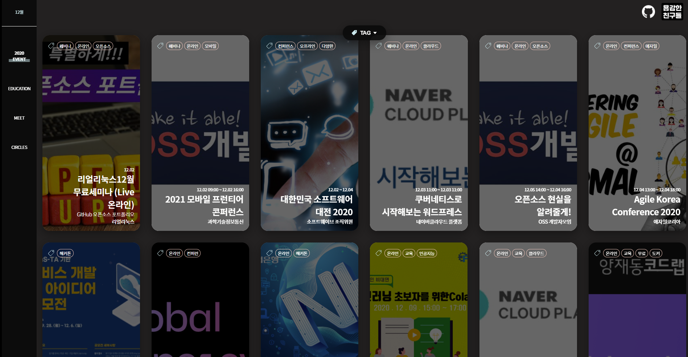
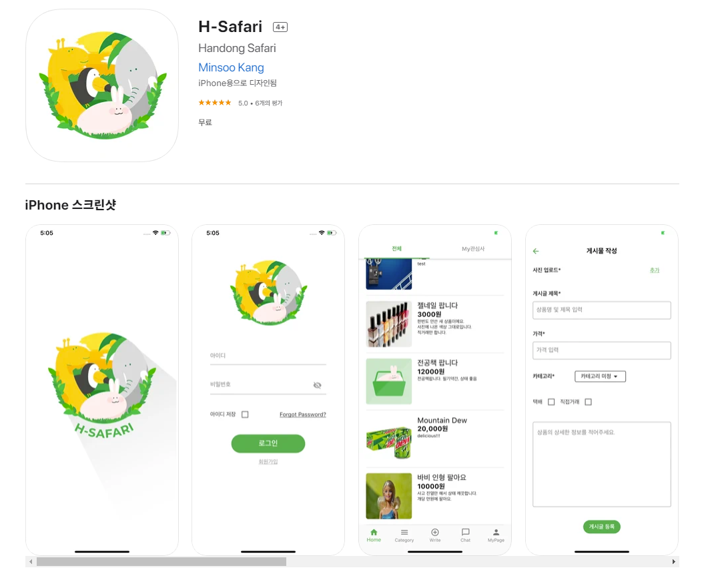
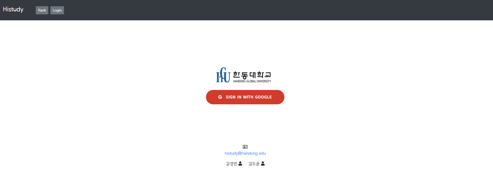

# 🚀 한동인이 만든 프로젝트를 소개합니다

> 동아리, 혹은 한동대 학우들과 프로젝트를 한 작품을 자유롭게 올리시면 됩니다.

> 누락되거나 수정 및 삭제할 부분이 있다면 알려주세요! 

 

------------

  

- __Dev Event__
    - 설명: 개발자 행사를 알려드립니다!
    - 공개: 20. 12. 12.
    - 개발자: [@용감한 친구들](https://github.com/brave-people)
    - Github: [Link](https://github.com/brave-people/Dev-Event-Client)
    - Site Link: [https://brave-people.github.io/Dev-Event-Client/](https://brave-people.github.io/Dev-Event-Client/)

------------

  

- __H-Safari__
    - 설명: 한동인을 위한 중고거래앱!
    - 공개: 20. 08 
    - 개발자: CRA [@coolgogi](https://github.com/coolgogi), [@Yejin Yeon](https://github.com/yeonyaily), [@Yeonhee77](https://github.com/Yeonhee77). [@pangil6683](https://github.com/pangil6683)
    - Github: [coolgogi/H-Safari](https://github.com/coolgogi/H-Safari)
    - App store: [Link](https://apps.apple.com/kr/app/h-safari/id1528003397)

------------

  

- __His study__
    - 설명: 한동대 전산전자 학생들의 스터디 그룹 관리 웹입니다.
    - 공개: 20. 02(?)
    - 개발자: [@dodoyoon](https://github.com/dodoyoon), [@Sung-Min-Kim](https://github.com/Sung-Min-Kim)
    - Github: [Link](https://github.com/dodoyoon/Histudy)
    - Site Link: [Link](https://histudy.cafe24.com/login/)

 

------

## 한동대 전산 동아리

> 전산 동아리에 가입하면 함께 프로젝트를 할 수 있는 탁월한 동료를 만날 수 있습니다!

- __CRA__
    - Official Github: [Link](https://github.com/cra16) 
- __슬기짜기__
    - Official Github: [Link](https://github.com/HGU-slegizzagi)

